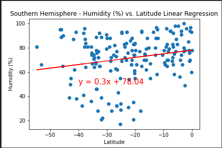

# Python API Homework - What's the Weather Like?

## Background

Discovering weather patterns around the world can be interesting study.  We will take a look at certian weather aspects can influence different parts of the world. 

## Part I - WeatherPy

Top 3 Observations: 
1. The Latitude vs. Temperature plot did not behave in the way that I expected, as you move north of the equator from latitude of 0 to 40 there is actually a linear decrease in temperature from 35 degrees F to -60 degrees F from 20 degrees latitude to around 80 degrees latitude.

2. Wind speed, humidity and cloudiness show very little to no correlation to latitude.

3. In the Northern Hemisphere the linear regression has and r-squared value of -0.87, indicating there is a strong negative linear relationship between decreasing latitude and decreasing temperature in the Northern Hemisphere. This is not the case in the Southern Hemisphere.

Temperature vs. Latitude

Observation - The Latitude vs. Max Temperature plot is interesting. As you move north of the equator from a latitude of 0 to a latitude of 40 you see what appears to be a linear decrease in temperature from 35 degrees to -60 degrees from 20 degrees latitude to around 80 degrees latitude.

Humidity vs. Latitude

Observation - The Latitude vs. Humidity plot does not seem to have a strong correlation to latitude. It appears more cities have a humidity above 60% than a humidity below 60%.

Cloudiness vs. Latitude

The Latitude vs. Cloudiness plot does not seem to have any correlation to latitude. Most areas are concentrated either at 100% or at 0%.

Wind Speed (mph) vs. Latitude

The Latitude vs. Wind Speed scatterplot suggests there is no correlation between Wind Speed and Latitude. The majority of the wind speed is between 0 and 10%.

Northern Hemisphere - Temperature (F) vs. Latitude

In the Northern Hemisphere the linear regression has and r-squared value of -0.87, indicating there is a strong negative linear relationship between decreasing latitude and decreasing temperature in the Northern Hemisphere.

Southern Hemisphere - Temperature (F) vs. Latitude

In the Southern Hemisphere there is a weaker relationship between temperature and latitude especially when compared to the Northern Hemisphere, with an r-squared value of 0.52. This means the linear curve fit can only account for 52% of the variance seen in the data.

Northern Hemisphere - Humidity (%) vs. Latitude

There ia a very weak relationship between latitude and humidity in the Northern Hemisphere with an r-squared value of 0.33. This means the linear curve fit can only account for 33% of the variance seen in the data, leaving the vast majority of the variance unexplained by the equation of the line y = 0.33x + 62.32.

Southern Hemisphere - Humidity (%) vs. Latitude

There ia a very weak relationship between latitude and humidity in the Southern Hemisphere with an r-squared value of 0.21. This means the linear curve fit can only account for 21% of the variance seen in the data, leaving the vast majority of the variance unexplained by the equation of the line y = 0.3x + 78.04.

Northern Hemisphere - Cloudiness (%) vs. Latitude

There ia a very weak relationship between latitude and cloudiness in the Northern Hemisphere with an r-squared value of 0.27. This means the linear curve fit can only account for 27% of the variance seen in the data, leaving the vast majority of the variance unexplained by the equation of the line y = 0.53x + 37.27.

Southern Hemisphere - Cloudiness (%) vs. Latitude

There ia a very weak relationship between latitude and cloudiness in the Southern Hemisphere with an r-squared value of 0.25. This means the linear curve fit can only account for 25% of the variance seen in the data, leaving the vast majority of the variance unexplained by the equation of the line y = 0.72x + 64.44.

Northern Hemisphere - Wind Speed (mph) vs. Latitude

There ia a very weak relationship between latitude and wind speed in the Northern Hemisphere with an r-squared value of 0.2. This means the linear curve fit can only account for 20% of the variance seen in the data, leaving the vast majority of the variance unexplained by the equation of the line y = 0.03x + 2.64.

Southern Hemisphere - Wind Speed (mph) vs. Latitude

There ia a very weak relationship between latitude and wind speed in the Southern Hemisphere with an r-squared value of -0.32. This means the linear curve fit can only account for -32% of the variance seen in the data.

### Part II - VacationPy

* Create a heat map that displays the humidity for every city from Part I.

  

*

* Plot the hotels on top of the humidity heatmap with each pin containing the **Hotel Name**, **City**, and **Country**.

  

As final considerations:

* You must complete your analysis using a Jupyter notebook.
* You must use the Matplotlib or Pandas plotting libraries.
* For Part I, you must include a written description of three observable trends based on the data.
* For Part II, you must include a screenshot of the heatmap you create and include it in your submission.
* You must use proper labeling of your plots, including aspects like: Plot Titles (with date of analysis) and Axes Labels.
* For max intensity in the heat map, try setting it to the highest humidity found in the data set.

## Hints and Considerations

* The city data you generate is based on random coordinates as well as different query times. As such, your outputs will not be an exact match to the provided starter notebook.

* If you'd like a refresher on the geographic coordinate system, [this site](http://desktop.arcgis.com/en/arcmap/10.3/guide-books/map-projections/about-geographic-coordinate-systems.htm) has great information.

* Next, spend the requisite time necessary to study the OpenWeatherMap API. Based on your initial study, you should be able to answer basic questions about the API: Where do you request the API key? Which Weather API in particular will you need? What URL endpoints does it expect? What JSON structure does it respond with? Before you write a line of code, you should be aiming to have a crystal clear understanding of your intended outcome.

* A starter code for Citipy has been provided. However, if you're craving an extra challenge, push yourself to learn how it works: [citipy Python library](https://pypi.python.org/pypi/citipy). Before you try to incorporate the library into your analysis, start by creating simple test cases outside your main script to confirm that you are using it correctly. Too often, when introduced to a new library, students get bogged down by the most minor of errors -- spending hours investigating their entire code -- when, in fact, a simple and focused test would have shown their basic utilization of the library was wrong from the start. Don't let this be you!

* Part of our expectation in this challenge is that you will use critical thinking skills to understand how and why we're recommending the tools we are. What is Citipy for? Why would you use it in conjunction with the OpenWeatherMap API? How would you do so?

* In building your script, pay attention to the cities you are using in your query pool. Are you getting coverage of the full gamut of latitudes and longitudes? Or are you simply choosing 500 cities concentrated in one region of the world? Even if you were a geographic genius, simply rattling 500 cities based on your human selection would create a biased dataset. Be thinking of how you should counter this. (Hint: Consider the full range of latitudes).

* Once you have computed the linear regression for one chart, the process will be similar for all others. As a bonus, try to create a function that will create these charts based on different parameters.

* Remember that each coordinate will trigger a separate call to the Google API. If you're creating your own criteria to plan your vacation, try to reduce the results in your DataFrame to 10 or fewer cities.

* Ensure your repository has regular commits (i.e. 20+ commits) and a thorough README.md file.

* Lastly, remember -- this is a challenging activity. Push yourself! If you complete this task, then you can safely say that you've gained a strong mastery of the core foundations of data analytics and it will only go better from here. Good luck!

### Copyright

Trilogy Education Services © 2020. All Rights Reserved.
